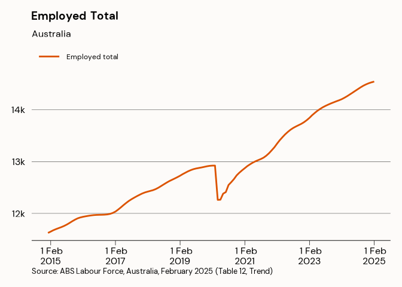

<!-- README.md is generated from README.Rmd. Please edit that file -->

# reportabs

<!-- badges: start -->

[](https://github.com/aiti-flinders/reportabs/actions)
<!-- badges: end -->

The `reportabs` package is designed to make reporting on ABS data
easier. It is designed to work with (most of!) the data included in the
`aitidata` package. `reportabs` contains functions to help with both
visual and textual reporting of data.

## Installation

`reportabs` can be installed from github with:

``` r
# install.packages("remotes")
remotes::install_github("aiti-flinders/reportabs")
```

Examples of how to use this package use the data included in the
`aitidata` package. It can be installed, however it is quite big. If you
don’t want to install it, you can access data from within `reportabs`.

``` r
# library(aitidata)
remotes::install_github("aiti-flinders/aitidata")

labour_force <- read_absdata("labour_force")
```

It is also recommended that the tidyverse is installed and loaded.

``` r
# library(tidyverse)
install.packages("tidyverse")
```

## What can this package do?

This package is designed to:

- report changes in labour market (or other data) indicators and;
- plot labour market (or other data) indicators over time

### Reporting

The key to reporting data is `filter_with()`. Each function in this
package takes a list of parameters which must be specified to generate
the correct data. `filter_with()` requires you to specify *at least* an
indicator by `list(indicator = " ")`. The available indicators for each
dataset can be viewed with `distinct()` from the dplyr package for
example `distinct(labour_force, indicator)`. `filter_with()` will also
accept a gender, a state/territory (including Australia), an age group,
and a series type. If they are not specified it will default to:

``` r
list(indicator = "",
gender = "Persons",
state = "Australia",
series_type = "Seasonally Adjusted"
)
```

The following functions can assist with reporting ABS labour market
indicators:

- `average_over()`: Calculate the average value of a labour market
  indicator over a period.

``` r
average_over(data = labour_force, filter_with = list(indicator = "Employed total"), between = c(2010, 2020))
#> [1] 11876908
```

- `change()`: Calculate the absolute and relative change in a labour
  market indicator over any period of time, and report the result
  nicely, with correct grammar.

``` r
change(data = labour_force, filter_with = list(indicator = "Employed total"))
#> Returning data for 2023 July
#> Returning data for 2022 July
#> [1] "increased by 398,947 (2.8%) to 14.06 million"
```

- `current()`: Report the current value of a labour market indicator.
- `growth()`: Report the growth of a labour market indicator.
- `last_value()`: Report the value of a labour market indicator for the
  previous year or month.
- `value_at()`: Report the value of a labour market indicator in a
  specific year and month.

Numbers can be formatted nicely for inclusion in documents using
`as_comma()`, `as_percent()` and `as_percentage_point()`.

### Plotting

`abs_plot()` will do most of the heavy lifting for you, if you know the
indicator you want to plot. If not, typing `plot_` and pressing tab will
show the included plots.
`abs_plot(labour_force, indicator = "Employed total", states = "Australia")`
is identical to `plot_employed_total("Australia")`.

``` r
abs_plot(labour_force, indicator = "Employed total", states = "Australia")
```



``` r
abs_plot(labour_force, indicator = "Employed total", states = "South Australia", markdown = TRUE)
```


